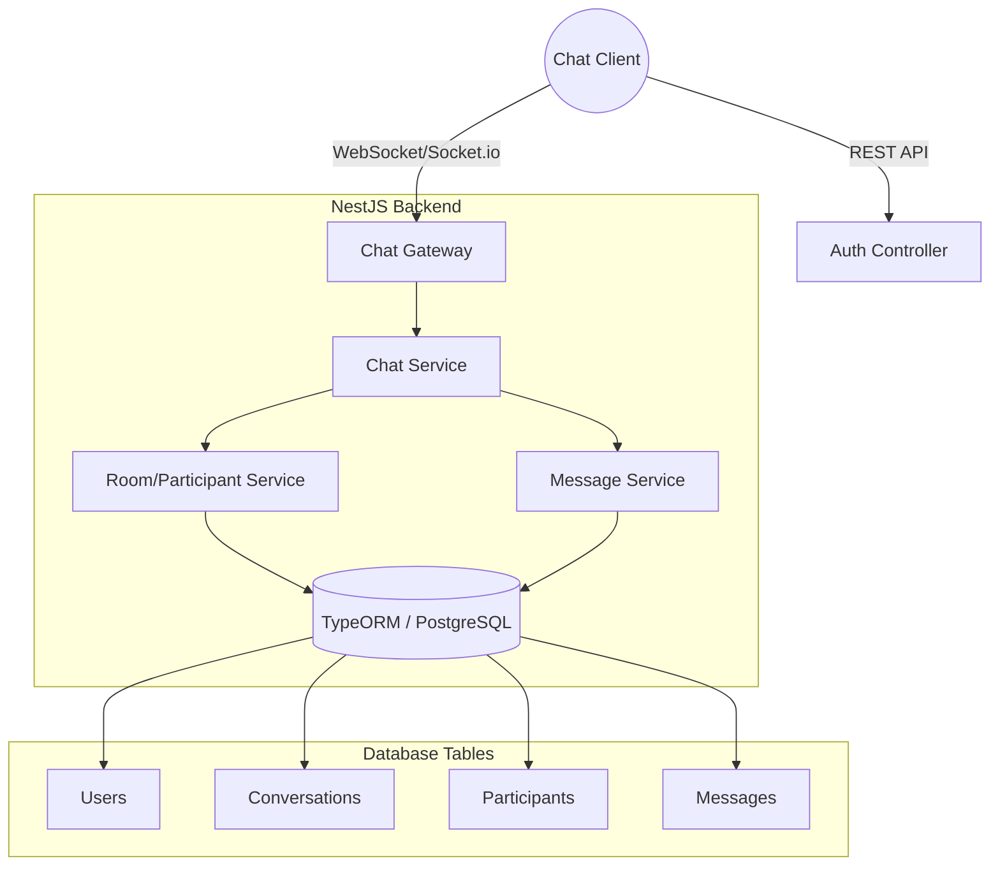
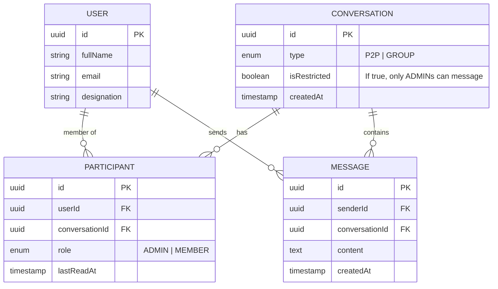
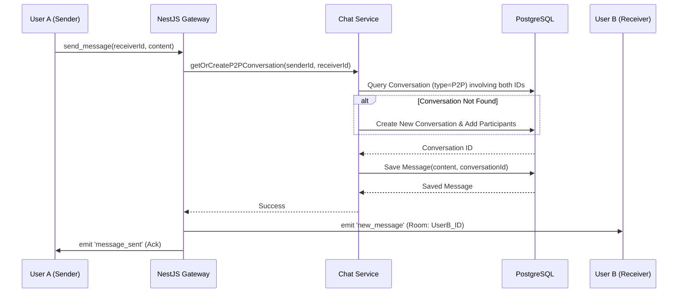
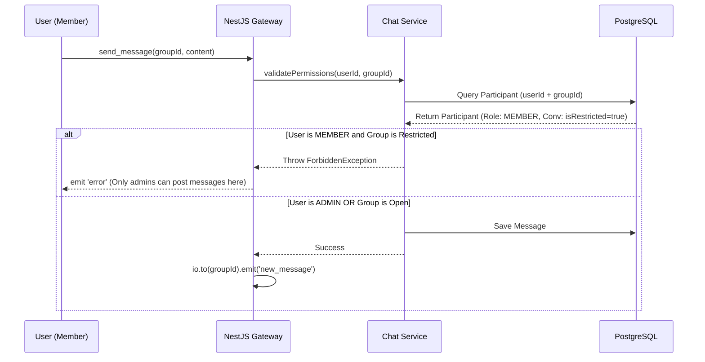

# Messenger System Technical Specification

This document details the architecture and implementation plan for a real-time messaging system integrated into a NestJS, PostgreSQL, and TypeORM stack.

## 1. System Architecture

The system uses a Modular NestJS approach. Socket.io handles real-time communication, while TypeORM manages the persistence of messages and conversation metadata.



## 2. Database Schema (ERD)

To support both Peer-to-Peer (P2P) and Groups, we utilize a polymorphic "Conversation" model. A "Participant" link-table determines a user's role and access rights within that conversation.

**Note:** The `User` entity references the existing Identity module.



## 3. Core Logic & Sequence Diagrams

### 3.1. Peer-to-Peer (P2P) Messaging

In P2P mode, the system first checks if a private conversation exists between the two users. If not, it creates one.



### 3.2. Restricted Group Messaging

This flow implements the requirement: "Group with only specific peers can message." The system checks the `isRestricted` flag on the conversation and the sender's role in the Participant table.



## 4. Implementation Strategy (TypeORM)

### Restricted Check Logic

Inside your `ChatService`, you can implement the permission check efficiently:

```typescript
async function canUserSendMessage(
  userId: string,
  conversationId: string,
): Promise<boolean> {
  const conversation = await this.conversationRepo.findOne({
    where: { id: conversationId },
  });

  // If it's a standard open group or P2P, allow
  if (!conversation.isRestricted) return true;

  // Check if user is an ADMIN
  const participant = await this.participantRepo.findOne({
    where: { userId, conversationId },
  });

  return participant?.role === 'ADMIN';
}
```

## 5. Deployment & Scalability Notes

- **WebSocket Rooms**: Upon connection, use `socket.join(user.id)` to make targeting P2P messages easy. For groups, use `socket.join(group.id)`.
- **Indexing**: Create a composite index in PostgreSQL on `(conversationId, createdAt DESC)` for the Messages table to ensure fast loading of chat history.
- **Authentication**: Pass the JWT token in the WebSocket handshake. Verify it in a `WsGuard` before allowing the connection.
- **Redis**: If you scale horizontally (multiple server instances), use the Socket.io Redis Adapter to synchronize events across nodes.
